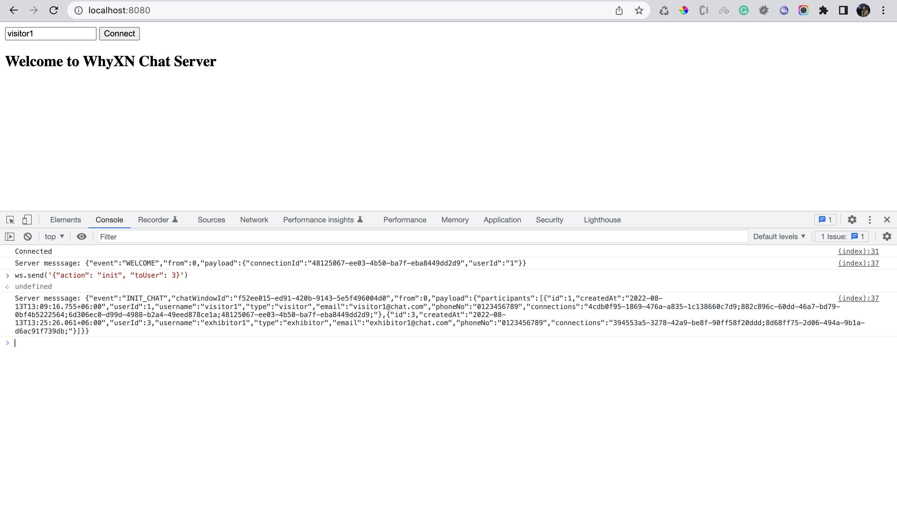
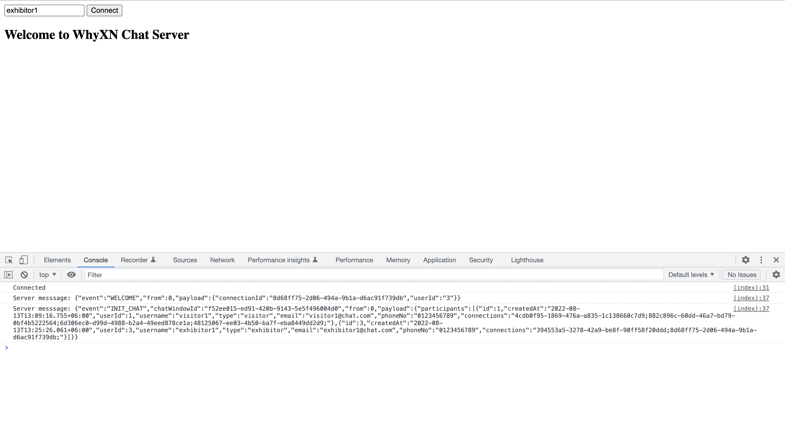
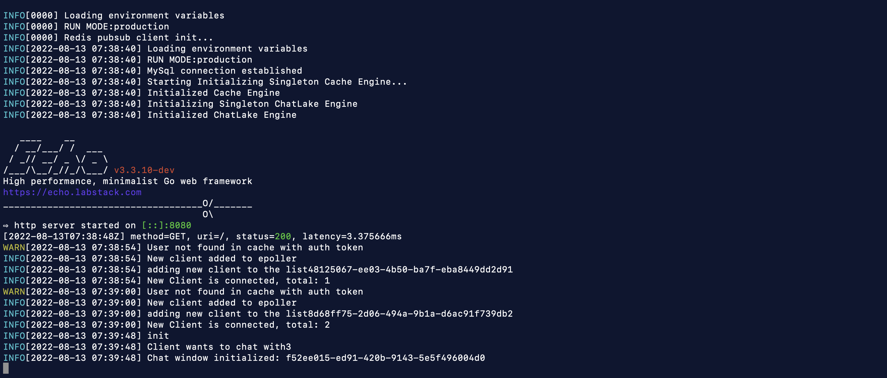

## GO CHAT

Go Chat is a Chat Server with Epoll based connection handling written in Golang.

### HOW TO RUN
**Prerequisites**
* MySQL Server
* Redis Server

<br/>

**Create a Docker Network**
````
docker network create -d bridge chat-network
````

**MySQL**
````
docker run -d --name mysql \
    --net=chat-network \
    -e MYSQL_ROOT_PASSWORD=keepitsecret \
    -e MYSQL_DATABASE=gochat \
    -e MYSQL_USER=gochat \
    -e MYSQL_PASSWORD=keepitsecret \
    -p 3306:3306 \
    mysql:8.0
````
**Redis**
````
docker run -d --name redis \
    --net=chat-network \
    -p 6379:6379 \
    redis:7-alpine
````

**Docker Build**

````
docker build -t whyxn/go-chat-backend .
````


**Docker Run**
````
docker run --rm -it --name=go-chat-backend \
    --net=chat-network \
    -e RUN_MODE=production \
    -e HTTP_SERVER_PORT=8080 \
    -e WS_SERVER_PORT=8888 \
    -e REDIS_HOST=redis \
    -e REDIS_PORT=6379 \
    -e REDIS_PASSWORD= \
    -e MYSQL_HOST=mysql \
    -e MYSQL_PORT=3306 \
    -e MYSQL_DB=gochat \
    -e MYSQL_USERNAME=gochat \
    -e MYSQL_PASSWORD=keepitsecret \
    -e AUTH_TOKEN_VALIDATION_ENDPOINT=https://external-auth.server.com/api/auth/token/verify \
    -e REDIS_MESSAGE_OUTGOING_CHANNEL=cnl-outgoing \
    -p 8080:8080 \
    -p 8888:8888 \
    whyxn/go-chat-backend:latest
````


**Access Application** \
`http://localhost:8080`

**Test User Tokens** \
`visitor1`\
`exibitor1`

<br/>

**Screen Shots** \
Connecting User: Visitor 1

Connecting User: Exhibitor 1

Server Log:


<br/>

**Clean Up**
````
docker kill mysql
docker rm mysql
docker kill redis
docker rm redis
````
